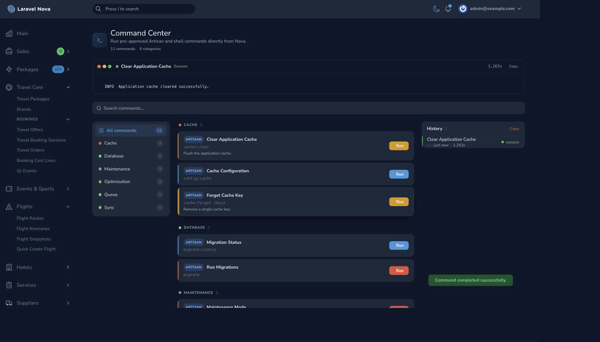
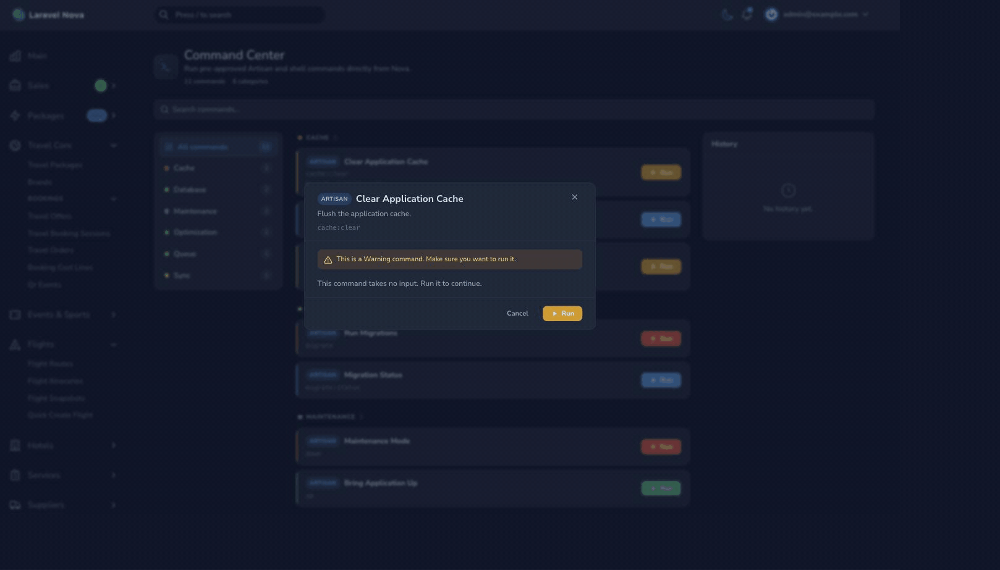
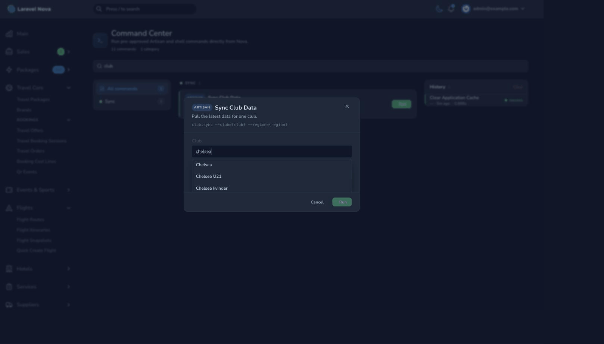
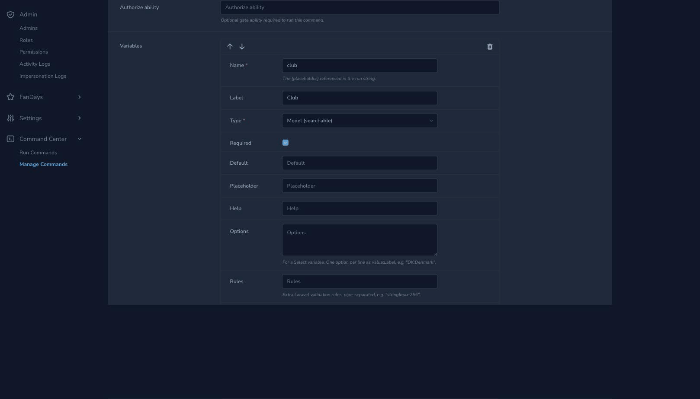

# Nova Command Center

[](https://github.com/farsidev/nova-command-center/actions/workflows/tests.yml)
[](https://github.com/farsidev/nova-command-center/actions/workflows/static-analysis.yml)
[](https://packagist.org/packages/farsi/nova-command-center)
[](LICENSE.md)

Run pre-approved Artisan and shell commands directly from your Laravel Nova
dashboard — safely. Built for and tested against **Nova v4 and v5**.

This package is a security-first, clean-room reimagining of the command-center
idea. It fixes the long-standing problems of earlier tools: shell injection,
Nova 5 incompatibility (`__ is not defined`), null-value crashes, missing
optional variables and the absence of authorization hooks.



<details>
<summary><strong>▶ See it in action</strong> — searching, model-backed variables, confirmation and live output</summary>



</details>

| Searchable model variables | Structured command editor |
| --- | --- |
|  |  |

---

## Highlights

- 🔒 **Injection-proof by design.** User input is never interpolated into a
  shell string. Commands run through Symfony Process as an argument vector, so a
  value like `; rm -rf /` is passed as one literal argument and nothing else.
- ✅ **Allow-list only.** Only commands you define in config can run. Free-form
  commands and shell (`bash`) execution are **off by default**.
- 🧩 **Nova 4 & 5 compatible.** One code path, Laravel Mix build, and a
  translation shim that survives Nova 5 removing the global `__` helper.
- 🧵 **Sync & queued execution** with live, polled output and progress bars.
- 🛡️ **Authorization** via a gate and optional per-command policies.
- 🕓 **History** without a database migration.
- 🔧 **Variables & flags**, including optional variables and `select` inputs.
- 🚦 **Concurrency control** (`without_overlapping`) and **rate limiting**.
- 🎨 **Polished, responsive UI** that follows Nova's light/dark theme, with live
  output, copy-to-clipboard and progress bars.

---

## Requirements

| Package      | Version                    |
| ------------ | -------------------------- |
| PHP          | 8.1+                       |
| Laravel      | 10, 11 or 12               |
| Laravel Nova | 4.x or 5.x                 |

## Installation

```bash
composer require farsi/nova-command-center
```

Register the tool in `app/Providers/NovaServiceProvider.php`:

```php
use Farsi\NovaCommandCenter\CommandCenter;

public function tools(): array
{
    return [
        (new CommandCenter)->canSee(function ($request) {
            return $request->user()?->isAdmin() ?? false;
        }),
    ];
}
```

Publish the configuration:

```bash
php artisan vendor:publish --tag=nova-command-center-config
```

## Configuration

All commands live in `config/nova-command-center.php`. A command is keyed by its
display name; only `run` is required.

```php
'commands' => [

    'Clear Application Cache' => [
        'run' => 'cache:clear',
        'group' => 'Cache',
        'type' => 'warning',
        'help' => 'Flush the application cache.',
    ],

    'Forget Cache Key' => [
        'run' => 'cache:forget {key}',
        'group' => 'Cache',
        'variables' => [
            'key' => [
                'label' => 'Cache key',
                'type' => 'text',
                'required' => true,
                'rules' => ['string', 'max:255'],
            ],
        ],
    ],

    'Run Migrations' => [
        'run' => 'migrate',
        'group' => 'Database',
        'type' => 'danger',
        'flags' => [
            ['label' => 'Force in production', 'flag' => '--force', 'default' => true],
        ],
    ],

],
```

### Command options

| Key            | Type            | Description                                              |
| -------------- | --------------- | ------------------------------------------------------- |
| `run`          | string          | Command to run. Use `{name}` placeholders for variables. |
| `command_type` | `artisan`/`bash`| Defaults to `artisan`.                                   |
| `group`        | string          | UI grouping.                                             |
| `type`         | string          | Button style: `primary`, `danger`, `warning`, …         |
| `help`         | string          | Description shown under the command.                     |
| `timeout`      | int             | Max seconds before the process is killed.                |
| `output_size`  | int             | Number of trailing output lines to display.             |
| `queue`        | bool / array    | Run on the queue. Array may set `connection` / `queue`.  |
| `can`          | string          | Gate ability required to run this specific command.      |
| `confirm`      | bool            | Force/skip the confirmation modal. Default: `danger`/`warning` types confirm, others don't. |
| `variables`    | array           | User input, keyed by placeholder name (see below).       |
| `flags`        | array           | Optional flags rendered as checkboxes.                   |

### Where commands come from

By default the allow-list is read from the config file — version-controlled,
reviewed in pull requests, and immutable at runtime. This is the recommended,
safest posture. The source is pluggable via the `source` key:

```php
'source' => [
    'driver' => 'config', // 'config' (default), 'database', or a custom class-string
    'model'  => \Farsi\NovaCommandCenter\Models\Command::class,
],
```

Anything that reads command definitions implements the tiny
[`CommandSource`](src/Contracts/CommandSource.php) contract, so raw definitions
can come from anywhere. Regardless of the source, every definition still passes
through the same coercion, validation and security model — a custom source can
never widen the trust boundary or bypass the bash/rate-limit/authorization gates.

```php
use Farsi\NovaCommandCenter\Contracts\CommandSource;

final class YamlCommandSource implements CommandSource
{
    public function definitions(): iterable
    {
        return yaml_parse_file(base_path('commands.yaml'));
    }
}

// config/nova-command-center.php
'source' => ['driver' => YamlCommandSource::class],
```

### Managing commands in the database

Prefer editing commands from the Nova UI instead of a config file? Opt into the
database source. **Read the security note first.**

1. Publish and run the migration:

   ```bash
   php artisan vendor:publish --tag=nova-command-center-migrations
   php artisan migrate
   ```

2. Switch the driver in `config/nova-command-center.php`:

   ```php
   'source' => ['driver' => 'database'],
   ```

3. Register the bundled Nova resource from your own `NovaServiceProvider` — ideally
   behind a strict policy so only trusted operators can edit the allow-list:

   ```php
   use Farsi\NovaCommandCenter\Nova\Command;

   Nova::resources([Command::class]);
   ```

Rows in the `nova_command_center_commands` table map one-to-one onto the config
keys documented above (`run`, `command_type`, `group`, `variables`, `flags`, …),
plus `enabled` (bool) and `position` (int) to toggle and order them.

Variables and flags are edited through structured, repeatable sub-forms — add a
variable block, pick its type (`text`, `select` or searchable `model`), fill in
labels, options and validation rules as plain inputs, and drag to reorder. No
JSON required. See [command sources](docs/command-sources.md) for details.

> ⚠️ **Security:** the database driver moves the allow-list out of version control.
> Anyone who can create or edit those rows decides what the tool will run — that is
> remote code execution by design. Protect the resource with a policy
> (`CommandPolicy`), restrict it to super-admins, keep bash **disabled** unless you
> truly need it, and remember every run still emits audit events. If you don't need
> UI-managed commands, stay on the `config` driver.

### Variables

Variables are referenced in `run` with `{name}` placeholders. Because
substitution happens **after** the command is tokenised, a variable can only
ever become the content of a single argument — never a new one.

```php
'variables' => [
    'email' => [
        'label' => 'User email',
        'type' => 'text',            // 'text', 'select' or 'model'
        'required' => false,         // optional variables are fully supported
        'default' => null,
        'options' => [               // for 'select'
            ['value' => 'daily', 'label' => 'Daily'],
            ['value' => 'weekly', 'label' => 'Weekly'],
        ],
        'rules' => ['email'],        // extra Laravel validation rules
    ],
],
```

An optional variable that is left blank simply removes its placeholder token,
so `foo --tag={tag}` becomes `foo` when `tag` is empty.

A `type => 'model'` variable renders as a type-ahead search box backed by a
real Eloquent model instead of a plain text input — useful when the argument
is a record id picked from a large or dynamic table. Its backing model must
be explicitly allow-listed via `searchable_models`, and matching is always
case-insensitive regardless of database driver. See "Searchable model
variables" in [`docs/configuration.md`](docs/configuration.md) for the full
schema and security notes.

### Authorization

Every request is checked against the tool's `canSee` callback. In addition, you
may define a global gate ability (default `runCommand`) and/or per-command `can`
abilities:

```php
// AuthServiceProvider
Gate::define('runCommand', fn ($user) => $user->isAdmin());
Gate::define('deploy', fn ($user) => $user->isOwner());
```

```php
// config
'authorize' => 'runCommand',
'commands' => [
    'Deploy' => ['run' => 'deploy:run', 'can' => 'deploy'],
],
```

### Shell (bash) commands

Shell execution is **disabled by default**. When enabled, only allow-listed
commands run, and arguments are always escaped. Shell features such as pipes and
redirection are intentionally unsupported — wrap those in a script file instead.

```php
'bash' => ['enabled' => true],

'commands' => [
    'Disk Usage' => ['run' => 'df -h', 'command_type' => 'bash', 'group' => 'System'],
],
```

### Queued execution & progress bars

Mark a command as `queue => true` to run it on a worker with live, polled output.
To report progress from your own Artisan command, use the provided trait:

```php
use Farsi\NovaCommandCenter\Concerns\InteractsWithProgress;

class RebuildSearchIndex extends Command
{
    use InteractsWithProgress;

    public function handle(): int
    {
        $this->novaProgressStart($items->count());

        foreach ($items as $item) {
            // ...
            $this->novaProgressAdvance();
        }

        $this->novaProgressFinish('Done');

        return self::SUCCESS;
    }
}
```

## Events

Every execution dispatches `Farsi\NovaCommandCenter\Events\CommandStarted` and
`CommandFinished`, each carrying the command definition, the execution result and
the operator — handy for audit logging.

## Documentation

Deep-dive guides live in [`docs/`](docs/README.md):

- [Configuration](docs/configuration.md) — every config key.
- [Command sources](docs/command-sources.md) — config, database (Nova resource) and custom sources.
- [Security model](docs/security.md) — the full threat model.
- [Authorization](docs/authorization.md) — gate, ability and per-command policies.
- [Queued execution & progress bars](docs/progress-bars.md) — queueing and live progress.
- [Frontend, theming & dark mode](docs/frontend.md) — building and customising the UI.

## Security

See [SECURITY.md](SECURITY.md) for the threat model and how to report a
vulnerability. In short: allow-list only, no shell interpolation, bash off by
default, authorization required, and every value is validated before it runs.

## Development

The frontend is built with Laravel Mix (the build system Nova uses on both v4
and v5):

```bash
npm install
npm run dev      # or: npm run watch / npm run prod
```

Backend quality tools:

```bash
composer test      # Pest
composer analyse   # PHPStan
composer lint      # Pint (dry run)
```

> Nova is a paid, private package. Running the test suite locally requires Nova
> credentials, or the provided `composer.testing.json` scaffold that swaps in a
> lightweight stub. See [CONTRIBUTING.md](CONTRIBUTING.md).

## License

The MIT License. See [LICENSE.md](LICENSE.md).
